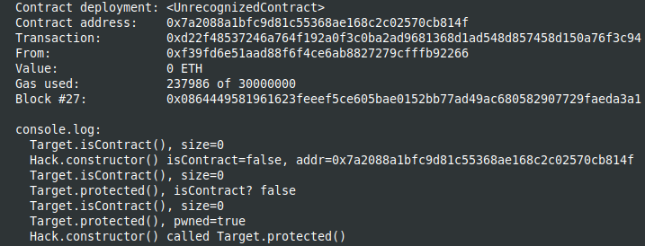

Study case of Bypass Contract Size Check hack, from Solidity by example site [Solidity by Example, Bypass Contract Size Check](https://solidity-by-example.org/hacks/contract-size/)

I use brownie to compile and deploy into hardhat in order to have the console.log feature.
You should start the hardhat node in another terminal and folder (`hh node`), then, in a terminal :

```
brownie compile
brownie run scripts/deploy.py
```

After deploying from brownie :


The result in the hardhat console :




Inside the constructor, for the contract being created, the contract size is 0, only after the constructor finished, the size is >0.

So, checking that an address is not a contract from the constructor of a contract being created, will report true.
